# Semantic Segmentation Project

**Udacity Self-Driving Car Engineer Nanodegree Program – Term 3, Project 2: Semantic Segmentation**

This repository contains the code written to complete the second project in term 3 of the [Udacity Self-Driving Car Engineer Nanodegree Program](https://www.udacity.com/course/self-driving-car-engineer-nanodegree--nd013). This project uses semantic segmentation to label the pixels of a road in images using a Fully Convolutional Network (FCN).

## Code description

The ```load_vgg()``` method downloads a pre-trained ```VGG16``` model and extracts the input, keep probability, layer 3, layer 4, and layer 7 ([main.py, lines 21-46](./main.py#L21-L46)). Using these extracted layers the ```layer()``` method creates the rest of the Fully Convolutional Network (FCN):

| Tensor                | Code description                                       | Code lines                 |
|:----------------------|:-------------------------------------------------------|:--------------------------:|
| ```layer7_conv_1x1``` | 1x1 convolutional layer based on ```VGG16```'s layer 7 | [60-62](./main.py#L60-L62) |
| ```layer7_upsample``` | Upsampling by 2                                        | [64-66](./main.py#L64-L66) |
| ```layer4_conv_1x1``` | 1x1 convolutional layer based on ```VGG16```'s layer 4 | [68-70](./main.py#L68-L70) |
| ```layer4_skip```     | Skip connections through addition of last two layers   | [72](./main.py#L72)        |
| ```layer4_upsample``` | Upsampling by 2                                        | [74-76](./main.py#L74-L76) |
| ```layer3_conv_1x1``` | 1x1 convolutional layer based on ```VGG16```'s layer 3 | [78-80](./main.py#L78-L80) |
| ```layer3_skip```     | Skip connections through addition of last two layers   | [82](./main.py#L82)        |
| ```layer3_upsample``` | Upsampling by 8                                        | [84-86](./main.py#L84-L86) |

Every convolutional layer and transposed convolutional layer uses an initializer that generates a truncated normal distribution with a standard deviation of 0.01 and a L2 kernel regularizer with a scale of 0.001.

After the network is defined the ```optimize()``` method creates the optimizer and the cross entropy loss using an Adam Optimizer ([main.py, lines 91-110](./main.py#L91-L110)).

Finally, the network is trained using the ```train_nn()``` method ([main.py, lines 114-144](./main.py#L114-L144)) with a keep probability of 0.5 and a learning rate of 0.00001. During training log messages describe the behaviour of the loss value.

## Training

The network has been trained using the [Kitti Road dataset](http://www.cvlibs.net/datasets/kitti/eval_road.php) (289 images) from [here](https://s3-us-west-1.amazonaws.com/udacity-selfdrivingcar/advanced_deep_learning/data_road.zip). The network training has been run for 6, 12, 24, and 48 epochs using a batch size of 8. The following table 

| Number of epochs | Loss of last epoch |
|:----------------:|:------------------:|
| 6 epochs         | 0.374891           |
| 12 epochs        | 0.123707           |
| 24 epochs        | 0.094930           |
| 48 epochs        | 0.050753           |

## Sample images

### urban unmarked lanes #41 (uu_000041.png)

|           |                                                         |
|----------:|:-------------------------------------------------------:|
| 6 epochs  | 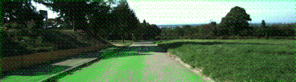   |
| 12 epochs | 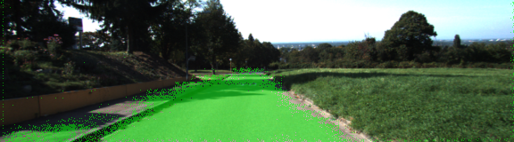   |
| 24 epochs | 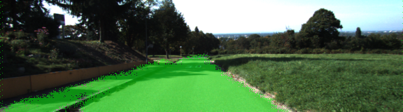   |
| 48 epochs | 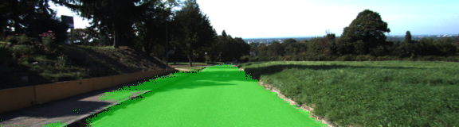   |

### urban unmarked lanes #81 (uu_000081.png)

|           |                                                         |
|----------:|:-------------------------------------------------------:|
| 6 epochs  | 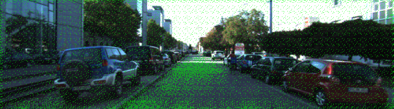   |
| 12 epochs |    |
| 24 epochs | 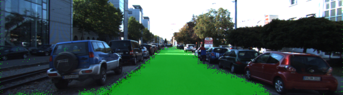   |
| 48 epochs | 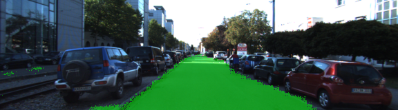   |

### urban marked lanes #37 (um_000037.png)

|           |                                                         |
|----------:|:-------------------------------------------------------:|
| 6 epochs  | 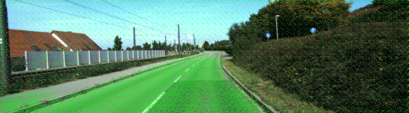   |
| 12 epochs | 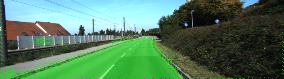   |
| 24 epochs | 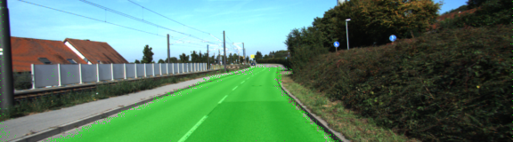   |
| 48 epochs | 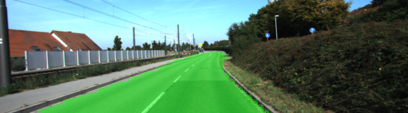   |

### urban marked lanes #79 (um_000079.png)

|           |                                                         |
|----------:|:-------------------------------------------------------:|
| 6 epochs  | 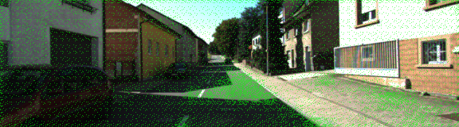   |
| 12 epochs | 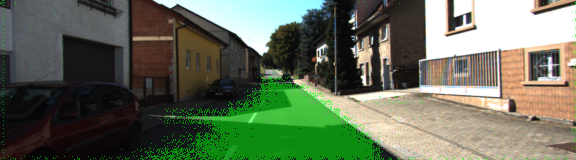   |
| 24 epochs | 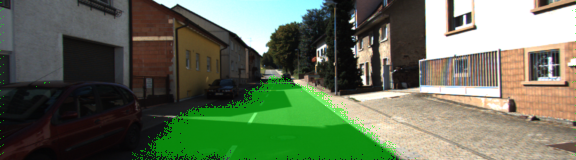   |
| 48 epochs | 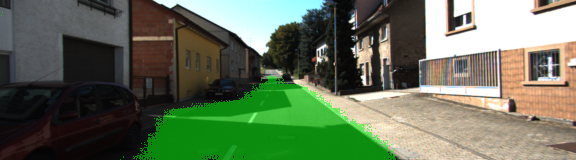   |

### urban multiple marked lanes #14 (umm_000014.png)

|           |                                                         |
|----------:|:-------------------------------------------------------:|
| 6 epochs  | 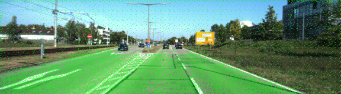 |
| 12 epochs | 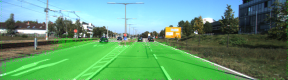 |
| 24 epochs | 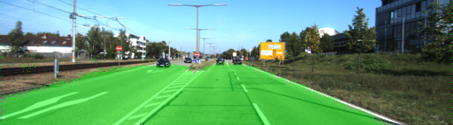 |
| 48 epochs | 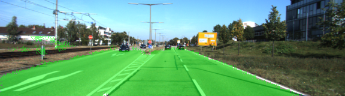 |

### urban multiple marked lanes #37 (umm_000037.png)

|           |                                                         |
|----------:|:-------------------------------------------------------:|
| 6 epochs  | 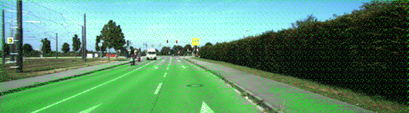 |
| 12 epochs | 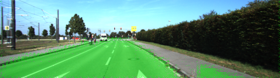 |
| 24 epochs | 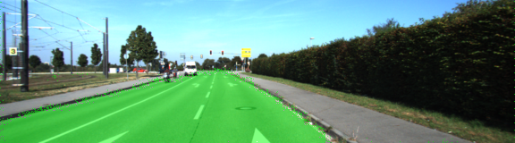 |
| 48 epochs | 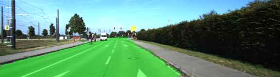 |

*The description below is Udacity's original README from the [seed project](https://github.com/udacity/CarND-Semantic-Segmentation).*

---

# Semantic Segmentation
## Introduction
In this project, you'll label the pixels of a road in images using a Fully Convolutional Network (FCN).

## Setup
### GPU
`main.py` will check to make sure you are using GPU - if you don't have a GPU on your system, you can use AWS or another cloud computing platform.
### Frameworks and Packages
Make sure you have the following is installed:
 - [Python 3](https://www.python.org/)
 - [TensorFlow](https://www.tensorflow.org/)
 - [NumPy](http://www.numpy.org/)
 - [SciPy](https://www.scipy.org/)
### Dataset
Download the [Kitti Road dataset](http://www.cvlibs.net/datasets/kitti/eval_road.php) from [here](http://www.cvlibs.net/download.php?file=data_road.zip).  Extract the dataset in the `data` folder.  This will create the folder `data_road` with all the training a test images.

## Start
### Implement
Implement the code in the `main.py` module indicated by the "TODO" comments.
The comments indicated with "OPTIONAL" tag are not required to complete.
### Run
Run the following command to run the project:
```
python main.py
```
**Note** If running this in Jupyter Notebook system messages, such as those regarding test status, may appear in the terminal rather than the notebook.

## Submission
1. Ensure you've passed all the unit tests.
2. Ensure you pass all points on [the rubric](https://review.udacity.com/#!/rubrics/989/view).
3. Submit the following in a zip file:
    * `helper.py`
    * `main.py`
    * `project_tests.py`
    * Newest inference images from `runs` folder  (**all images from the most recent run**)

## Tips
- The link for the frozen `VGG16` model is hardcoded into `helper.py`.  The model can be found [here](https://s3-us-west-1.amazonaws.com/udacity-selfdrivingcar/vgg.zip).
- The model is not vanilla `VGG16`, but a fully convolutional version, which already contains the 1x1 convolutions to replace the fully connected layers. Please see this [forum post](https://discussions.udacity.com/t/here-is-some-advice-and-clarifications-about-the-semantic-segmentation-project/403100/8?u=subodh.malgonde) for more information.  A summary of additional points, follow. 
- The original FCN-8s was trained in stages. The authors later uploaded a version that was trained all at once to their GitHub repo.  The version in the GitHub repo has one important difference: The outputs of pooling layers 3 and 4 are scaled before they are fed into the 1x1 convolutions.  As a result, some students have found that the model learns much better with the scaling layers included. The model may not converge substantially faster, but may reach a higher IoU and accuracy. 
- When adding l2-regularization, setting a regularizer in the arguments of the `tf.layers` is not enough. Regularization loss terms must be manually added to your loss function. otherwise regularization is not implemented.
 
## Using GitHub and Creating Effective READMEs
If you are unfamiliar with GitHub , Udacity has a brief [GitHub tutorial](http://blog.udacity.com/2015/06/a-beginners-git-github-tutorial.html) to get you started. Udacity also provides a more detailed free [course on git and GitHub](https://www.udacity.com/course/how-to-use-git-and-github--ud775).

To learn about REAMDE files and Markdown, Udacity provides a free [course on READMEs](https://www.udacity.com/courses/ud777), as well. 

GitHub also provides a [tutorial](https://guides.github.com/features/mastering-markdown/) about creating Markdown files.
